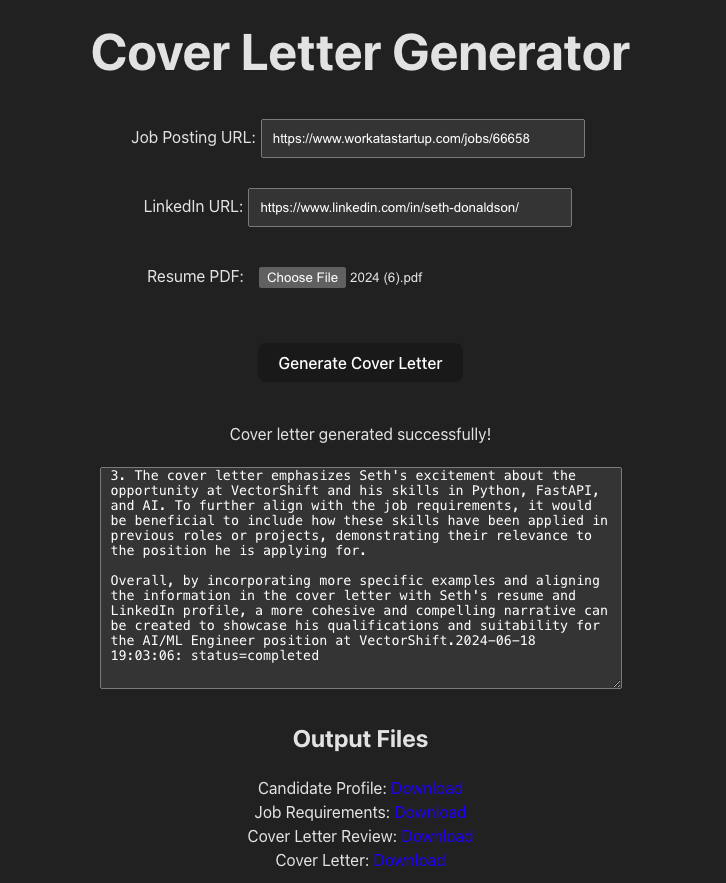

# AI-Powered Cover Letter Generator

This React web app leverages a team of AI agents to craft personalized cover letters, demonstrating my expertise in AI development and natural language processing. It's designed to showcase my AI engineering skills and look cute in my portfolio (see note below).

**Live Demo:** https://cover-letter-builder-delta.vercel.app/

NOTE:

* Currently the production version of the app is only using a single Celery worker on a single GCP VM. This is because the app is only meant to showcase my abilities as an AI and AI systems engineer, and not meant to serve hundreds of users (vms aren't free!!). If you are a job candidate and wish to use the functionality of this repo, please download and use the prototype jupyter notebook located in this repo.

[Prototype Code (Jupyter Notebook)](backend/notebooks/job_application_crew_V2.ipynb)

## Features

* **LinkedIn Integration:** Extracts relevant information from a candidate's LinkedIn profile.
* **Job Posting Analysis:** Parses job descriptions to understand key requirements and qualifications.
* **Resume Parsing:** Extracts skills and experience from a candidate's resume.
* **AI Agent Collaboration:** A crew of specialized AI agents work together to generate a tailored cover letter.
* **Transparency:** Displays detailed logs of the AI crew's execution and individual agent outputs.

## How It Works

1. **Input:**
   - Candidate's LinkedIn profile URL
   - Job posting URL
   - Candidate's resume (PDF)

2. **AI Processing:**
   - The AI crew analyzes the input data, extracting relevant information and identifying key points.
   - Agents collaborate to generate a well-structured, persuasive cover letter.

3. **Output:**
   - A polished cover letter
   - Detailed logs of the AI process for transparency and insight

## Technologies Used

### Back-end
* **Flask:** For the backend application
* **CrewAI:** For building and managing the AI agents.
* **LangChain:** For text tools.
* **Docker:** For building and deploying the flask app.
* **Cloud Run:** For continuous integration and deployment (in conjunction with Docker).
* **Celery:** For asynchronous execution of AI crews on the backend
* **SocketIO:** For streaming CrewAI execution logs to the front end
* **Redis:** For facilitating both SocketIO and Celery workers
* **Google Cloud Storage:** For facilitating uploading and downloading of user/crew documents

### Front-end
* **React:** Front-end framework for building the user interface.
* **Vite:** Fast development server for a smooth development experience.
* **Vercel:** Hosting platform for deploying the live application.

## Project Goals (For Recruiters)

* Showcase my ability to develop complex AI systems that solve real-world problems.
* Demonstrate proficiency in React, natural language processing, GCP, and AI development.
* Highlight my understanding of how to structure and deploy a production-ready AI application.
* Provide a unique and valuable tool that could potentially benefit recruiters and candidates alike.

## Thanks
Special shoutout and thanks to João Moura, CrewAI, and Deeplearning.AI for their course [Multi AI Agent Systems with crewAI](https://www.deeplearning.ai/short-courses/multi-ai-agent-systems-with-crewai/) which I followed closely to create the prototype for this app.